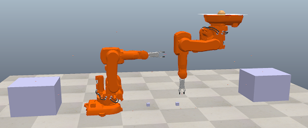

# Dual Arm Collision Avoidance with Potential Fields

## Team Members and Roles

- **Joshua Huang** _Project Lead_: Potential Field Program Structure and Debugging, Report Writing, Figure Creation
- **Andres Dickson Alarcon** _Software Lead_: Potential Fields Programming, Coppelia Sim Scene Making, Figure Data Collection
- **Savo Vidakovic** _Software Member_: Gripper Code, Scene Work, Forward Kinematics Code

## Introduction

The complexity of robot manipulation tasks for a single robot arm is limited to the capabilities of a single manipulator. It is similar to a human holding one hand behind their back while going about their lives which helps illustrate how difficult it would be. Completing tasks like handling multiple objects at a time, opening containers, or assembling objects would be much more difficult resulting in a longer time to complete tasks and the need for supporting tools to augment a one-arm setup. Before enabling these tasks a large challenge stands to ensure that two arms can operate in a shared space without colliding with each other causing errors or damage to the arms. There are many approaches to ensure that the robot arms are not colliding with each other and typically defining all of the solid bodies and the objects in an environment is necessary to ensure that collision checks can be performed prior to an action being executed. While this approach can ensure collisions are avoided between arms it requires a significant amount of computational power to check for collision and also requires that trajectories are checked for collisions prior to being executed.

Our project utilizes potential fields in order to model attractive points associated with points of interest and tasks we want the robot arm to move toward. To represent points to avoid collision with repulsive fields were placed on them. By taking the sum of the attractive and repulsive fields experienced at the end effector it is possible to determine the net force acting on the end effector that can be translated into movements of the robot actuators. By representing attractive and repulsive potential fields movement of the robotic arms is more robust to collision prevention rather than moving along predefined robot arm trajectories which does not allow end effector movement to be updated in real-time.
Utilizing potential fields for a dual robot arm scenario enables robots to work in an overlapping workspace and perform unplanned tasks while still adapting to changes in the environment that are modeled with potential fields. We also utilized attractive potential fields as waypoints to further constrain the actions of the robot arm resulting in desired task completion.

Our project employed multiple concepts from class. We utilized potential fields to model the attractive and repulsive fields on the end effectors which resulted in force vectors that could be translated into robot joint movement. We used forward kinematics and defined a DH parameter table to continually track the midpoints of the robot's linkages and end effector which was used to update the placement of the repulsive fields on the robot. To control the robot joints we used a joint velocity control scheme which required us to utilize Jacobian transfer functions to translate potential field forces in the scene space into the joint space. We also utilized gain values and adjusted the Kp value to adjust oscillatory effects during the control of the robot associated with PID controls.
The outcome of our project was two robot arms running at the same time that operated in an overlapping workspace while grabbing their respective cubes and moving them toward the desired position. The end effectors' potential field forces from the attractive and potential fields nearby were also visualized to understand the movements of the end effectors.

## Approach

We created a Coppelia sim scene where two IRB 410 robotic arms were placed close together so that they had an overlapping workspace at the end effector and the proximal linkage to the end effector. We constrained the scene to only require movement in the x and z direction for simplicity in representing potential fields in 2 dimensions. We only utilized the second and third degrees of freedom to move in these two axes. The base robot joint was fixed in place. The primary objective was for each robot arm to move its cube from its starting position to the platform. If this was attempted without considering the other robot and simply using inverse kinematics to command the joint position there was a high risk that the robot arms would collide and would be unable to complete the desired task.

_Figure 1: CoppeliaSim scene of dual-arm robot._

To implement a potential field collision avoidance system our overall software implementation is shown in figure 2. We first start by connecting to the Coppelia Sim environment via Python so we can pull real-time information from the simulation. The next thing we do is define all of the object handles and store object positions in variables to determine where attractive and repulsive potential fields would be stored.

  

Figure 2: Potential Field Script Function Diagram.

The functions are also defined during the initialization step. We define functions to pull the joint angles from the simulation and input them into a DH parameter table that is used to output the position of the linkage midpoints and the end effector in the scene coordinate space. A function called compute_jacobian is defined which takes in the joint angles and lengths of a 3-degree-of-freedom robot and outputs a 3x3 Jacobian matrix to describe the relationship between joint velocities and end-effector velocities in Cartesian coordinates. The function compute_reppotgrad was used to define a gradient of the repulsive potential between a point that we wanted to model as an obstacle and the position of the robot end effector. We also have a threshold function that defines that the repulsive field is only applied within a set distance from the obstacle otherwise the gradient of the repulsive potential is zero. The compute_attpotgrad function computes the gradient of the attractive potential between the desired point of interest and the robot. The function is responsible for pulling the robot towards the desired location.

The next part of the script defines the points that will have attractive and repulsive fields assigned to them. Attractive fields are placed on the cube and the final target location. Repulsive fields are assigned to the robot's end effectors and linkage midpoints. We also found that repulsive fields needed to be defined on points on the floor surface to reduce the number of collisions during the movement sequence. In addition, waypoints were defined, and attractive points would be assigned to them in a defined sequence to pull the robot in the desired direction. Finally, code was defined to ensure that the gripper attached to the robot would continue to stay attached.
The first while loop that is defined is responsible for moving the robot from its starting point toward the cube to be picked up. The loop continually updates the position of the end effector relative to the cube and pulls the updated position of the linkage midpoints using the DH parameter function. Next repulsive and attractive fields are assigned accordingly to attract the robot arm toward the cube while avoiding collisions. The attractive and repulsive force vectors are then summed together for the first robot arm and the second robot arm. The force vector is then multiplied by the Jacobian transfer function that was defined to convert the cartesian space vector into joint velocities. A kp gain value for attraction and repulsion is multiplied by their respective components as well. Once the force vectors are converted into joint velocities for the first and second degree of freedom of both robots those values are then input as commands into the IRB410 robots and the robot velocity value is updated. An upper velocity bound was set in code to prevent high jerk instances while moving and ensure smooth movement of the robot arm at all times as well as reducing the risk of kp overshoot errors componing with high velocities that would result in instabilities. This while loop is run and each time it loops it continually compares the position of the robot gripper relative to the cube to determine if it has reached a defined threshold. The threshold value can be adjusted in order to allow the gripper to exit the loop at a closer or farther distance. Once the gripper is close enough to the cube it stops the joints from moving and initiates the grip command to grab the cube.

Next, the waypoints defined for robot 0 and robot 1 are stored in a tuple. A while loop is initiated that determines which waypoints potential field is active during the loop. It stores the current waypoint in a for loop and then updates the current waypoint when triggered. The trigger event to update the waypoint is based on the while loops threshold definition for the distance from the robot end effector to the waypoint, if the threshold is met it will move to the next waypoint. It will perform the same checks as the first while loop to move to the cube in order to update the joint velocities to move toward the waypoint. A keynote was that the previous forces imparted on the end effector from the previously active waypoint needed to be terminated in the active force vector environment to prevent the robot from moving towards the previous waypoint and not the active waypoint. This was done by resetting the force to zero after the waypoint was reached. Once it reached the final waypoint and was set over the platform the command was initiated in order to drop the cube onto the platform.

Some critical design choices were driven by the ECSE 275 class. Translating the forces imparted on the end effectors from attractive to potential fields was initially a large issue since we were not sure how to translate this into joint movement either through position control or potentially inverse kinematics control. Our initial solution was to use the force vectors in order to update the movement of the end effector by using inverse kinematics position updates of the end effector that were based on the net force vector acting on the robot. During one of our project update meetings, it became clear that a Jacobian transfer function was the perfect solution to implementing the joint controller required to translate the forces in the Cartesian space to joint velocity updates. In addition, we adopted the DH parameter table to update the linkage position since it only required joint angle inputs. Previously we considered pulling the location of the linkage midpoint as an object in Coppelia sim which would have significant issues with mapping the real-time joint locations in a real-world application since it relied on the software simulation environment data and not on the robot's data like joint position.

A few experiments were run to get the robot arm to achieve successful task completion of moving the robot arm from the starting position to the end position and delivering the cube. We were also interested in tracking the amount of time it took to complete the task of delivering the cube to the goal point when parameters like end effector position threshold and max threshold were adjusted to determine if the task could be completed faster or if it was even capable of achieving the task. In our first implementation, the attractive points were defined only at the cube and at the final placement location. We were unable to complete the task and could not get a time under this trial. We first defined additional repulsive fields on the floor to prevent it from trying to go toward the goal point by going under the robot base. This resulted in the end effector getting stuck in a potential field saddle point or local minima. Instead, we need to add stronger potential fields to move the robot in the desired direction before reaching the final placement point. This led to the implementation of waypoints and 3-way points were added in order to attract the end effector in the direction of the placement while following the desired trajectory. The result of this implementation was a successful delivery of the cube from its initial position to the desired position. To adjust the performance of the system and improve the time to complete the task we altered the max threshold of the base repulsive field and incrementally increased them. When the repulsive field threshold was increased which resulted in a stronger repulsive field the task was completed in less than half of the initial time. In addition, the attractive force max threshold parameters were modified which resulted in interesting results. While we initially assumed that increasing the threshold of the attractive force would correlate to a reduction in task completion time it had varying effects on the completion time of the system.

## Results

_Figure 3: Time to complete the task when the repulsive field parameter was adjusted._

| **Base Repulsive Field Threshold Value** | **Time to Complete (s)** |
| ---------------------------------------- | ------------------------ |
| Nominal = 0.7                            | 113.94                   |
| 1                                        | 64.14                    |
| 0.65                                     | 157.31                   |
| 1.2                                      | 51.52                    |
| 1.4                                      | 44.99                    |
| 2                                        | 44.152                   |
| 2.5                                      | 45.31                    |

_Table 1: Repulsive Field Parameter Adjustment Effect on Completion Time_

We adjusted the base repulsive field threshold value which. For the most part, we performed trials where we increased the threshold value which meant that the repulsive field force was stronger. We had an initial time to complete the task of 113.94 under the initially tuned parameters. When we made the threshold value smaller which meant that the repulsive force was weaker we still completed the task but it took longer clocking in at 157.31 seconds to complete. To reduce the time it took to complete the task we observed that when we increased the threshold value to two more than doubled the initial value we clocked the shortest time to completion at 44.152 seconds. We did increase when the Threshold value was increased to 2.5 the time did slightly increase to 45.31 seconds, but it did not significantly increase. This may indicate that there is a local optimum that the repulsive threshold value can be adjusted to. Refer to Figure 3 and Table 1 for data related to this discussion. This was the most promising benchmark of task completion.

_Figure 3: Time to completion when attractive forces were adjusted._

| **Attractive Field ε** | **Time to Complete (s)** |
| ---------------------- | ------------------------ |
| Nominal ε = 100        | 113.94                   |
| 90                     | 106.85                   |
| 150                    | 111.36                   |
| 20                     | 134.75                   |

_Table 2: Attractive Field Parameter Adjustment Effect on Completion Time_

A second experiment was performed to see if adjusting the attractive field eps parameter would result in time-to-completion changes. It was observed that reducing the eps parameter would result in a longer time to completion while higher eps parameters resulted in shorter times to completion although a local optimum was present since if the eps value went too high the time to complete the task increased. Compared to the repulsive field threshold parameter this did not have a substantial improvement in time to completion. Refer to Figure 4 and Table 2.

_Figure 5: Demo of Potential Field Task Completion with Waypoints._

[Watch the complete demo](https://drive.google.com/file/d/1fjDQ1EtOlXW-Dy3IaOTrUIZYKznYtMya/view?usp=drive_link)

The potential field forces acting on the end effectors can be visualized in the figure 6.

_Figure 6: Potential Field Force Vectors Plotted in Real-time._

_Figure 7: Potential Field Robustness Test Case: Blocks Placed Closer Together_

To test the robustness of our implementation we placed the blocks very close together in order to determine if the robot arms would collide when they grabbed the blocks. The linkages and end effectors did not collide when placed together although there were some observed issues with the end effector placement initially. The system was capable of adapting to variable block placement. Overall we completed the outlined tasks envisioned for this project and executed them to complete the project by using potential fields to prevent arm collisions during task execution.

## Conclusions

In this project, we developed a dual-arm collision avoidance system using potential fields to enable two robot arms to operate within an overlapping workspace. Our approach used attractive potential fields to guide the arms toward task-relevant objects and goals, while repulsive potential fields were used to avoid obstacles, including the arms' own linkages, grippers, and the floor. By summing the forces from these fields, we generated movement commands for the robot joints using Jacobian-based velocity control.
The system successfully enabled the two arms to move their respective cubes from a start position to a final platform while avoiding collisions. We implemented waypoints to avoid local minima and ensure smooth, efficient trajectories. Several design iterations were made to optimize performance, including adjusting the repulsive field threshold and attractive force epsilon. The optimal tuning of these parameters significantly improved task completion time, with the best configuration reducing completion time from 113.94 seconds to 44.15 seconds.

To further develop this work, several enhancements can be made:

- Dynamic Waypoint Adjustment: Instead of using fixed waypoints, the system could dynamically generate waypoints in response to environmental changes.
- Full 3D Motion: The current system operates in a 2D (X-Z) plane. Expanding to all six degrees of freedom would increase its applicability in real-world robotic manipulation.
- Adaptive Gain Control: Dynamically tuning the system's control gains (Kp) during operation could improve stability and reduce oscillations.
- Multi-Robot Coordination: Extending the approach to handle multiple robot arms would increase the system's versatility for more complex tasks.

This work demonstrates the potential of potential field methods for enabling real-time, collision-free operation of dual-arm robotic systems. By combining efficient path planning with real-time responsiveness, this method provides a strong foundation for future research in multi-arm robotic manipulation.
